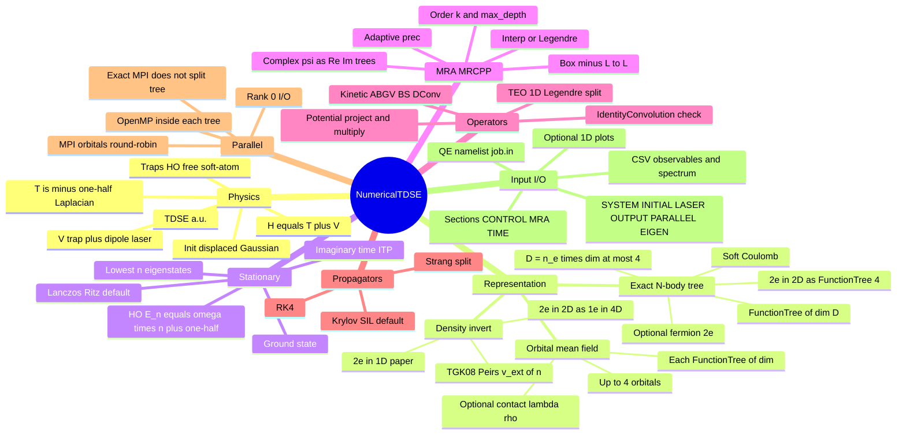
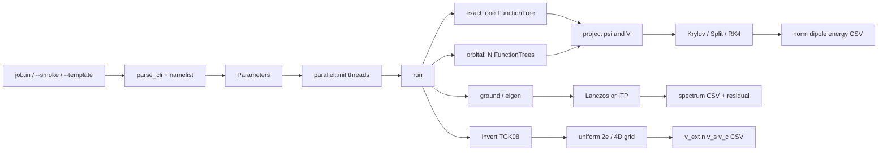

# NumericalTDSE

Adaptive multiwavelet solver of the time-dependent Schrödinger equation (TDSE), built on [MRCPP](https://github.com/MRChemSoft/mrcpp) (≥ 1.4, developed against the 1.6.0-alpha line that ships `TimeEvolutionOperator`).

**User guide:** [English](docs/USER_GUIDE.md) · [中文](docs/USER_GUIDE.zh.md)  
**Examples:** [examples/README.md](examples/README.md)

The code represents wave functions as `FunctionTree` objects on a `MultiResolutionAnalysis`, refines the grid from local wavelet-norm error estimates down to a user-specified precision `prec`, and propagates `i ∂t ψ = H ψ` with one of three algorithms (Krylov / Strang split-operator / RK4).

---

## 设计总览

One executable `tdse`, one `Parameters` object, two run modes, three propagators. MRCPP owns the adaptive grid; this code owns the TDSE, input, and time loop.



Run path:



Module map: `main` → `input` / `parameters` / `parallel` → `simulate` → `analytic` + `operators` + `propagator` + `eigen` + `invert` + `observables` + `wavefunction`, sitting on MRCPP trees except inversion (uniform grid).

---

## 物理与算法

原子单位下的 TDSE：

\[
i\,\partial_t\psi = \hat H(t)\,\psi,\qquad
\hat H = -\tfrac12\nabla^2 + V(\mathbf r,t).
\]

- **动能** \(T=-\frac12\nabla^2\)：默认用 MRCPP 推荐的 `ABGVOperator` 沿每个坐标方向作用两次；可选 `BSOperator` 或卷积形式的 `DerivativeConvolution`。
- **势能**：继承 `RepresentableFunction<D>`，每步 `project` 到 `FunctionTree`，再与波函数做 MW 乘法。含时激光取偶极近似 \(-E(t)\,x\)。
- **精确 N 体**（`mode = 'exact'`）：\(D=n_e\times\mathrm{dim}\le 4\) 的一张 `FunctionTree<D>`（Fetch 的 MRCPP 经 `cmake/patch_mrcpp_d4.py` 补丁后支持 D=4）。一维最多四电子，或二维双电子 \(\psi(x_1,y_1,x_2,y_2)\)。电子间软库仑 \(1/\sqrt{|r_i-r_j|^2+a^2}\)。
- **密度反演**（`calculation = 'invert'`）：两电子相互作用基态的 \(n\to v_\mathrm{ext}\)（Thiele–Gross–Kümmel / Peirs）。一维双电子与论文相同，波函数在 \(N\times N\) 格子上；二维双电子把 \(\psi(x_1,y_1,x_2,y_2)\) 当成 **4 维组态空间中的单粒子**。精确 TDSE/基态可走 `FunctionTree<4>`（`examples/harmonic_2e2d.in`）；反演循环仍用均匀网格。这比在二维轨道基里做 CI（“2D in 2D”）更直接：\(W(|r_1-r_2|)\) 是 4D 局域势，不必算双电子积分。
- **轨道平均场**（`mode = 'orbital'`）：最多 4 个轨道，每个是 `FunctionTree<dim>`，可选接触相互作用 \(\lambda\rho(\mathbf r)\)。四电子 3D 只能走这条路（12 维全波函数无法用 MW 表示）。

传播子：

| `propagator` | 公式 | 说明 |
|---|---|---|
| `krylov`（默认） | \(\psi\leftarrow\exp(-i\hat H\Delta t)\psi\) | 短迭代 Lanczos，任意维数，近幺正 |
| `split` | Strang：\(e^{-iV\Delta t/2}e^{-iT\Delta t}e^{-iV\Delta t/2}\) | 1D + Legendre 时动能指数是 `TimeEvolutionOperator` \(\exp(i(\Delta t/2)\partial_x^2)\)；更高维对 \(T\) 再用 Krylov |
| `rk4` | \(\partial_t\psi=-iH\psi\) 的四阶 Runge–Kutta | 实现最直观，非幺正，步长宜小 |

`IdentityConvolution` 在 \(t=0\) 作用一次，检查 \(\|I\psi-\psi\|\)（`ident_check = .false.` 关掉）。

---

## 依赖与编译

- C++17 编译器，CMake ≥ 3.16
- [MRCPP](https://github.com/MRChemSoft/mrcpp)（CMake 在找不到本地安装时会 FetchContent 指定 commit）
- Eigen3（由 MRCPP 自动拉取）
- 可选 OpenMP（多核，树操作内部并行）
- 可选 MPI（多节点；轨道模式按轨道分 rank）

```bash
cmake -S . -B build -DCMAKE_BUILD_TYPE=Release \
    -DNUMTDSE_OPENMP=ON -DNUMTDSE_MPI=ON -DCMAKE_CXX_COMPILER=g++
cmake --build build -j --target tdse
ctest --test-dir build --output-on-failure
```

若已安装 MRCPP：

```bash
cmake -S . -B build -DMRCPP_DIR=$HOME/Software/mrcpp/share/cmake/MRCPP
```

OpenMP 线程数：`export OMP_NUM_THREADS=8`，或在输入里写 `&PARALLEL nthreads = 8 /`。

---

## 并行（OpenMP + MPI）

MRCPP 只在 **OpenMP** 下并行化一张 `FunctionTree` 内部的 project / apply / multiply，**没有**把一棵树按空间拆到多个 MPI 进程。MPI 只提供整树的 `send_tree` / `recv_tree`。因此本求解器的用法是：

| 模式 | 多核（节点内） | 多节点 |
|---|---|---|
| `mode = 'exact'`（一张 N 体树） | OpenMP 线程 | 额外 MPI rank **不会加速**（会打印提示） |
| `mode = 'orbital'`（最多 4 个轨道） | 每张轨道树内部 OpenMP | 轨道 round-robin 分到各 rank，密度与观测量 MPI 约化 |

不要调用 MRCPP 的 `mrcpp::mpi::initialize()`（那是 MRChem 的 bank 进程模型，会占用并退出一部分 rank）。本程序用 `MPI_Init_thread(..., MPI_THREAD_FUNNELED)`，只在主线程做 MPI。

单节点多核：

```bash
export OMP_NUM_THREADS=16
export OMP_PROC_BIND=true
export OMP_PLACES=cores
./build/bin/tdse examples/harmonic_1d.in
```

多节点 + 每节点多核（轨道模式），例如 4 个 MPI rank、每个 rank 8 线程：

```bash
export OMP_NUM_THREADS=8
export OMP_PROC_BIND=true
export OMP_PLACES=cores
mpirun -np 4 --map-by ppr:1:node:pe=8 \
    ./build/bin/tdse examples/orbitals_4e.in
```

SLURM：

```bash
srun --ntasks=4 --cpus-per-task=8 --cpu-bind=cores \
    env OMP_NUM_THREADS=8 OMP_PROC_BIND=true OMP_PLACES=cores \
    ./build/bin/tdse examples/orbitals_4e.in
```

`examples/parallel.sh` 是一个本机 `mpirun -np 2` 的包装。输入文件需要在所有节点可见（共享文件系统）。

密度反演（给定 \(n\) 求相互作用 \(v_\mathrm{ext}\)）：

```bash
./build/bin/tdse examples/invert_smoke.in      # 2e in 1D, ctest
./build/bin/tdse examples/invert_2e1d.in       # 1D soft helium (TGK08)
./build/bin/tdse examples/invert_2e2d.in       # 2e in 2D as 1e in 4D
python3 examples/plot_inversion.py invert_2e1d_observables.csv
```

---

## 运行

输入是 Quantum ESPRESSO 风格的自由格式 namelist：只写需要改的关键字，其余保持默认。注释用 `!` 或 `#`，实数可用 Fortran `1.0d-4`，逻辑值为 `.true.` / `.false.`。

```bash
./build/bin/tdse examples/harmonic_1d.in
./build/bin/tdse -i examples/free_particle.in
./build/bin/tdse --template          # 打印带注释的完整模板
./build/bin/tdse --smoke             # 内置短跑，供 ctest
./examples/run_and_plot.sh examples/harmonic_1d.in
./build/bin/tdse examples/ground_1d.in
./build/bin/tdse examples/eigen_1d.in
```

段名：`&CONTROL` `&MRA` `&TIME` `&SYSTEM` `&INITIAL` `&LASER` `&OUTPUT` `&PARALLEL`  
别名：`CTRL`；`GRID` / `NUMERICS` → `MRA`；`PROPAGATOR` → `TIME`；`WAVEFUNCTION` / `PSI` → `INITIAL`；`FIELD` → `LASER`；`IO` / `OUT` → `OUTPUT`；`PARA` / `OMP` → `PARALLEL`。

```fortran
! 最小输入：1D 谐振子，其余全是默认值
&SYSTEM
  trap = 'harmonic'
/

&INITIAL
  x0 = 1.0
/
```

算例目录见 [examples/README.md](examples/README.md)：谐振子 / 自由高斯 / 激光 / 软原子 / 精确双电子 / 轨道平均场 / **基态与最低本征态**，多数可与解析 \(\mu(t)\)、\(E_n\) 或 \(|\langle\psi_\mathrm{num}|\psi_\mathrm{ana}\rangle|\) 对照。`calculation = 'smoke'` 会先载入短跑预设，文件里显式写出的关键字仍然生效。`calculation = 'ground'` / `'eigen'` 用 Lanczos（默认）或虚时传播求最低本征态。

画图（需 `pip install matplotlib`）：

```bash
python3 examples/compare_analytic.py harmonic_1d_observables.csv
python3 examples/plot_observables.py harmonic_1d_observables.csv
python3 examples/plot_wavefunction.py harmonic_1d_t0 --analytic ho --x0 1 --omega 1 --t 0
```

CSV 列（TDSE / 虚时）：`t, norm, dipole, energy, nodes_re, nodes_im, overlap_analytic, dipole_analytic, energy_analytic, residual`。本征谱：`state, energy, residual, overlap_analytic, energy_analytic, …`。`prefix = 'job'` 且未写 `output=` 时，观测文件为 `job_observables.csv`。完整关键字与解析公式见 [docs/USER_GUIDE.md](docs/USER_GUIDE.md) / [docs/USER_GUIDE.zh.md](docs/USER_GUIDE.zh.md)。

---

## 代码结构

```
include/tdse/
  parameters.hpp      精度 / 盒子 / 时间步 / 物理模型
  input.hpp           QE 风格 namelist 解析
  analytic.hpp        RepresentableFunction：初态与含时势能
  wavefunction.hpp    复数波函数 = (Re FunctionTree, Im FunctionTree)
  operators.hpp       MRA 算子：ABGV、IdentityConvolution、动能 / 势能作用
  propagator.hpp      Split / Krylov / RK4（含虚时）
  eigen.hpp           基态 / 最低本征态（Lanczos 与 ITP）
  invert.hpp          两电子密度反演（TGK08 / Peirs）
  nbody_grid.hpp      均匀网格 2e 基态（1D 或 4D 组态空间）
  setup.hpp           MRA 与投影公共函数
  observables.hpp     模方、偶极、能量、残差
  simulate.hpp        时间循环
  parallel.hpp        MPI + OpenMP（轨道分 rank，树内 OpenMP）
src/main.cpp          入口（MPI_Init_thread / Finalize）
src/parameters.cpp    CLI（input.in / --template / --smoke）
src/input.cpp         namelist 词法与赋值
src/parallel.cpp      MPI 约化与线程设置
docs/                 英文 / 中文使用手册
examples/             namelist 算例、解析对照与画图脚本
```

可调参数集中在 `Parameters`：`prec`, `order`, `max_depth`, `L`, `dt`, `T`。完整关键字见 `tdse --template`。

---

## 约定与限制

- 哈密顿量使用标准量子化学原子单位 \(T=-\frac12\nabla^2\)。MRCPP 的 `TimeEvolutionOperator` 表示 \(\exp(i\tau\partial_x^2)\)，因此传入 \(\tau=\Delta t/2\)。
- 该算子目前只实现于 **1D Legendre** 缩放函数。
- Fetch 的 MRCPP 经 `cmake/patch_mrcpp_d4.py` 补丁后支持 `FunctionTree<4>`。精确 N 体 \(D=n_e\times\mathrm{dim}\le 4\)。更高维请用 `mode = 'orbital'`。二维双电子的**反演**仍走 `calculation = 'invert'`（4D 均匀网格）。
- MPI 不能把一张精确 N 体树拆开；多节点请用 `mode = 'orbital'`。
- 默认演示参数偏向“能跑完”，要定量结果请把 `prec` 降到 `1d-5`–`1d-6` 并减小 `dt`。
